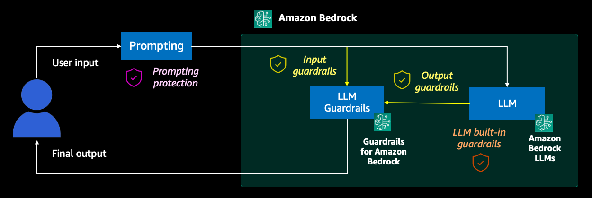

## Safeguarding a generative AI travel agent with prompt engineering and Guardrails for Amazon Bedrock

This is the example notebook for the AWS blog [Blog link]().

In this example, we explore a solution for securing a virtual travel agent powered by generative AI. Demonstrating how to implement prompt engineering techniques, content moderation, and various guardrails to ensure the assistant operates within predefined boundaries by relying on Guardrails for Amazon Bedrock. Additionally, we implement a monitoring strategy to track the activation of the safeguards, enabling proactive identification and mitigation of potential issues. By following the steps outlined in the notebook, you will be able to deploy your own secure and responsible chatbot, that you can tailor to your specific needs and use cases.

For building our chatbot we leverage a combination of AWS services and validation techniques to create a secure and responsible virtual travel agent that operates within predefined boundaries.

## Security

See [CONTRIBUTING](CONTRIBUTING.md#security-issue-notifications) for more information.

## License

This library is licensed under the MIT-0 License. See the LICENSE file.

